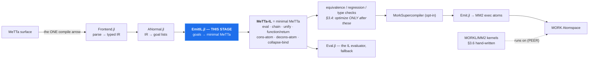

# The MeTTa → MeTTa-IL stage (design)

Design for `Core/src/compiler/EmitIL.jl`, the missing arrow — written before the code, because the
last emitter was built into the **wrong layer** and it took reopening the whitepaper to notice
(~1962 LOC targeting a stage with no incoming arrow). A diagram makes that check unskippable.

## 1. Where it goes

Figure 2 has exactly **one** compile arrow. MM2 reaches a node by a *dashed* "runs on" edge — a peer,
not a target.



The defect is **not** that `Emit.jl` emits MM2. SPECMAP C6: *"Fig-2 REQUIRES an MM2 emitter; what it
forbids is reaching MM2 WITHOUT PASSING THROUGH THE IR. `Emit.jl` is the right component in the wrong
POSITION; the fix is inserting the IR above it, not deleting it."* Today `ANormal → Emit` is a direct
edge; this stage goes between.

**Which "MeTTa-IL"?** Three artifacts share the name (SPECMAP C7). The target is **Hyperon minimal
MeTTa**. `MeTTaIL.jl` is the F1R3FLY GSLT `~>` artifact and contains *none* of these instructions —
it is not this stage and must not be routed through.

## 2. The mapping

Semantics from `docs/specs/metta grammar/metta_language_spec.md` §3 (normative table), cross-checked
against `Eval.jl:40` `MINIMAL_OPS`, which Core already evaluates.

A goal list is a conjunction; in minimal MeTTa a conjunction is a right-nested `chain` — bind an
intermediate, continue with the template. A-normal form already names every intermediate, so it maps
directly.

| goal | emitted | `Emit.jl` (MM2) |
|---|---|---|
| `GUnify(l,r)` | `(unify l r ⟨cont⟩ (return Empty))` | ✅ |
| `GCall(h,args,out)` | `(chain (eval (h args…)) out ⟨cont⟩)` | ✅ |
| `GBranch(c,cv,t,e,out)` | `⟨c⟩` then `(unify cv True ⟨t⟩ ⟨e⟩)` | ❌ declined |
| `GFindall(tmpl,body,out)` | `(chain (collapse-bind ⟨body⟩) out ⟨cont⟩)` | ❌ declined |
| `GDisj(branches,out)` | N separate `(= head body)` clauses | ❌ declined |
| `GResidual` | decline — counted, never dropped | ❌ declined |

A clause becomes `(= (f $x …) (function ⟨chain … (return $out)⟩))`.

**Why `GDisj` is not `superpose-bind`:** the table is precise — `(superpose-bind <result of
collapse-bind>)` consumes a collapse-bind result, not a branch list. Native MeTTa nondeterminism is
multiple `(=)` clauses (§2.1), which is what `GDisj`'s own docstring anticipates: *"whether a
disjunction becomes several MM2 exec rules or one is an EMISSION decision, and this stage must not
pre-empt it."* Decision made here: one clause per branch.

**Coverage: 2 of 6 → 5 of 6 goal types.** `Emit.jl:30-31` states its scope — only all-`GCall`/`GUnify`
clauses. Minimal MeTTa has native forms for branch, findall and disjunction that MM2 exec atoms lack.
That is a hypothesis to MEASURE on the corpus, not a claim to assert; the ratchet reports the number.

## 3. Invariants

1. **Invariant 1 (sequential effects)** — enforced above the lanes by `split_program_regions`
   (`SexprForms.jl`). This stage inherits it and must not re-flatten.
2. **Invariant 6 (dispatch = `query($space, (= $atom $X))`)** — emitting `(= head body)` preserves
   multi-result dispatch by construction. An MM2 `exec` is consumed on selection and one-shot, which
   is the deeper reason MM2 cannot *be* the IL.
3. **Decline visibly, never drop** — counted with reasons, as `Emit.jl` does.
4. **No `Any`-typed containers**, tests included.

## 4. Verification

Oracle, not pinned literals: feed each emitted clause to `Eval.jl` and compare answers against the
same source program through the interpreter. Assert on evaluated **answers**, never on emitted text.

## 5. CORRECTED (2026-09-03) — there is NO map-atom gap; `max_steps` EXHAUSTION IS SILENT

An earlier revision of this section (commit `dfe1536`) claimed the compiled lane could not evaluate
`map-atom` over a recursively-built list. **That claim was WRONG and is retracted.** The compiled
lane is correct. What follows is the real defect, which is about DIAGNOSABILITY, not semantics.

### The actual behaviour

`compile_run` returns an EMPTY ANSWER GROUP when it exhausts `max_steps`. An empty group is exactly
what a query with genuinely no answers returns, so **budget exhaustion is indistinguishable from a
correct negative result**. Nothing in the return value says "I ran out".

Sweeping the one parameter I was passing myself settles it — same program, same process:

```
max_steps=    4000   <NO ANSWER>
max_steps=   20000   (0 1 1 2 3 5)
max_steps=  100000   (0 1 1 2 3 5)
max_steps= 2000000   (0 1 1 2 3 5)
```

And the 2x2 that the retracted section said was a broken pairing — all four cells pass at a
sufficient budget:

| list source            | template     | result at max_steps = 2_000_000 |
|------------------------|--------------|---------------------------------|
| literal `(0 1 2 3 4 5)`| `(+ $x 1)`   | `(1 2 3 4 5 6)`                 |
| literal                | `(fib $x)`   | `(0 1 1 2 3 5)`                 |
| recursive `(upto 0 5)` | `(+ $x 1)`   | `(1 2 3 4 5 6)`                 |
| recursive              | `(fib $x)`   | `(0 1 1 2 3 5)`                 |

`(fib $x)` inside `map-atom` is simply expensive — the budget, not the construct, was the variable.

### Why this is still worth a section

1. **It manufactured a false cross-engine divergence.** `workflows/metta_xcheck.sh` calls
   `compile_run(...; max_steps = 40000)` for ONE FILE containing MANY queries, and the budget is
   spent across all of them. Early queries starve later ones, so the "Core COMPILED lane" column
   showed a partial answer list and the verdict read DIVERGENCE while every other engine agreed.
   The lane was right; the budget was too small and said nothing.
2. **It cost a whole bisection.** Seven constructs were varied before the one number being passed
   in was. [[feedback_cheapest_disconfirming_test_first]]

### The fix worth making

Exhaustion must be OBSERVABLE in the result — a flag, a distinct sentinel, or a raised error —
so a caller can tell "no answers" from "ran out of steps". Until then, any `compile_run` caller
reporting a negative result is reporting an unfalsifiable one, and `metta_xcheck.sh` should pass a
budget scaled to the query count.

### Genuinely open, NOT explained by the budget

The `decons-atom` spelling of the same program does not terminate in a reasonable time and is not
bounded by `max_steps` as expected: at `max_steps = 40000` it held the MettaJam interpreter lock
198s+, and at `max_steps = 200_000` it exceeded a 30s deadline still running, twice requiring a
server restart.

```metta
(= (map-t $f $l)
   (if (== $l ()) () (let ($h $t) (decons-atom $l) (let $m (map-t $f $t) (cons-atom ($f $h) $m)))))
!(let $ix (upto 0 5) (map-t fib $ix))
```

No root cause claimed. Whether this is the same budget being consumed far more slowly, or a path
`max_steps` does not bound at all, is UNDETERMINED — the two were not distinguished, and the
distinction is the whole question.
