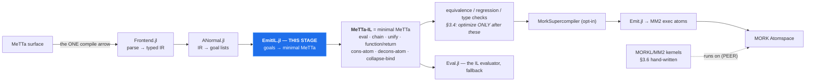

# The MeTTa → MeTTa-IL stage (design)

Design for `Core/src/compiler/EmitIL.jl`, the missing arrow — written before the code, because the
last emitter was built into the **wrong layer** and it took reopening the whitepaper to notice
(~1962 LOC targeting a stage with no incoming arrow). A diagram makes that check unskippable.

## 1. Where it goes

Figure 2 has exactly **one** compile arrow. MM2 reaches a node by a *dashed* "runs on" edge — a peer,
not a target.



The defect is **not** that `Emit.jl` emits MM2. SPECMAP C6: *"Fig-2 REQUIRES an MM2 emitter; what it
forbids is reaching MM2 WITHOUT PASSING THROUGH THE IR. `Emit.jl` is the right component in the wrong
POSITION; the fix is inserting the IR above it, not deleting it."* Today `ANormal → Emit` is a direct
edge; this stage goes between.

**Which "MeTTa-IL"?** Three artifacts share the name (SPECMAP C7). The target is **Hyperon minimal
MeTTa**. `MeTTaIL.jl` is the F1R3FLY GSLT `~>` artifact and contains *none* of these instructions —
it is not this stage and must not be routed through.

## 2. The mapping

Semantics from `docs/specs/metta grammar/metta_language_spec.md` §3 (normative table), cross-checked
against `Eval.jl:40` `MINIMAL_OPS`, which Core already evaluates.

A goal list is a conjunction; in minimal MeTTa a conjunction is a right-nested `chain` — bind an
intermediate, continue with the template. A-normal form already names every intermediate, so it maps
directly.

| goal | emitted | `Emit.jl` (MM2) |
|---|---|---|
| `GUnify(l,r)` | `(unify l r ⟨cont⟩ (return Empty))` | ✅ |
| `GCall(h,args,out)` | `(chain (eval (h args…)) out ⟨cont⟩)` | ✅ |
| `GBranch(c,cv,t,e,out)` | `⟨c⟩` then `(unify cv True ⟨t⟩ ⟨e⟩)` | ❌ declined |
| `GFindall(tmpl,body,out)` | `(chain (collapse-bind ⟨body⟩) out ⟨cont⟩)` | ❌ declined |
| `GDisj(branches,out)` | N separate `(= head body)` clauses | ❌ declined |
| `GResidual` | decline — counted, never dropped | ❌ declined |

A clause becomes `(= (f $x …) (function ⟨chain … (return $out)⟩))`.

**Why `GDisj` is not `superpose-bind`:** the table is precise — `(superpose-bind <result of
collapse-bind>)` consumes a collapse-bind result, not a branch list. Native MeTTa nondeterminism is
multiple `(=)` clauses (§2.1), which is what `GDisj`'s own docstring anticipates: *"whether a
disjunction becomes several MM2 exec rules or one is an EMISSION decision, and this stage must not
pre-empt it."* Decision made here: one clause per branch.

**Coverage: 2 of 6 → 5 of 6 goal types.** `Emit.jl:30-31` states its scope — only all-`GCall`/`GUnify`
clauses. Minimal MeTTa has native forms for branch, findall and disjunction that MM2 exec atoms lack.
That is a hypothesis to MEASURE on the corpus, not a claim to assert; the ratchet reports the number.

## 3. Invariants

1. **Invariant 1 (sequential effects)** — enforced above the lanes by `split_program_regions`
   (`SexprForms.jl`). This stage inherits it and must not re-flatten.
2. **Invariant 6 (dispatch = `query($space, (= $atom $X))`)** — emitting `(= head body)` preserves
   multi-result dispatch by construction. An MM2 `exec` is consumed on selection and one-shot, which
   is the deeper reason MM2 cannot *be* the IL.
3. **Decline visibly, never drop** — counted with reasons, as `Emit.jl` does.
4. **No `Any`-typed containers**, tests included.

## 4. Verification

Oracle, not pinned literals: feed each emitted clause to `Eval.jl` and compare answers against the
same source program through the interpreter. Assert on evaluated **answers**, never on emitted text.

## 5. MEASURED GAP (2026-09-03) — `map-atom` over a RECURSIVELY-COMPUTED list returns NO ANSWER

`compile_run` silently returns an EMPTY answer group where the interpreter answers correctly. Not a
crash, not a decline — the answer group is present and empty, so anything counting *groups* rather
than *answers* reads this as success. Found by running a fib-list exercise across the engines:
hyperon, CeTTa, PeTTa and the Core interpreter all returned `(0 1 1 2 3 5)`; the compiled lane
returned nothing for two of three queries.

REPRO (`MeTTaCore.compile_run(src; max_steps = 4000)`):

```metta
(= (fib $n)  (if (< $n 2) $n (+ (fib (- $n 1)) (fib (- $n 2)))))
(= (upto $k $n) (if (> $k $n) () (let $rest (upto (+ $k 1) $n) (cons-atom $k $rest))))
!(let $ix (upto 0 5) (map-atom $ix $x (fib $x)))    ; compiled: <NO ANSWER>   interp: (0 1 1 2 3 5)
```

ISOLATED — every ingredient works ALONE, so this is a pairing, not a missing feature:

| case                                                   | compiled lane   |
|--------------------------------------------------------|-----------------|
| `map-atom` over a LITERAL list                          | `(0 1 1 2 3 5)` |
| `upto` alone (bare, or wrapped in a user head)          | `(0 1 2 3 4 5)` |
| `let`-bound **literal** + `map-atom`                    | `(0 1 1)`       |
| `let`-bound list from a **recursive** fn + `map-atom`   | **`<NO ANSWER>`** |

`car-atom`/`cdr-atom`/`cons-atom`/`decons-atom`/`chain`/`function`+`return`/`unify`/`let` each
compile and evaluate correctly in isolation. The failing ingredient is the COMBINATION: a value
produced by a RECURSIVE user-defined function, `let`-bound, then passed to `map-atom` (whose list
parameter is typed `Expression` and so receives its argument UNREDUCED).

A RELATED and probably same-root symptom: the `decons-atom`-recursion spelling of the same program
(`(= (map-t $f $l) (if (== $l ()) () (let ($h $t) (decons-atom $l) ...)))`) did not return empty —
it HUNG, holding the MettaJam interpreter lock for 198s+ past `max_steps = 40000`, requiring a
server restart. Whatever bounds `max_steps` did not bound that path.

WHY §4's ORACLE DID NOT CATCH IT: §4 is the right oracle and it is wired — it compares compiled
answers against interpreter answers. It cannot see a defect the CORPUS never exercises, and no
corpus program passes a recursively-built list to a `Expression`-typed stdlib parameter. The fix is
a corpus entry, not a new oracle. [[feedback_oracle_inherits_corpus_coverage]]

NOT YET DIAGNOSED: no root cause is claimed here. The above is the reproducer and the bisection,
recorded so the next session starts from the narrow case rather than the exercise.
