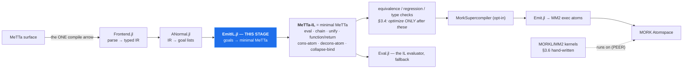

# The MeTTa → MeTTa-IL stage (design)

Design for `Core/src/compiler/EmitIL.jl`, the missing arrow — written before the code, because the
last emitter was built into the **wrong layer** and it took reopening the whitepaper to notice
(~1962 LOC targeting a stage with no incoming arrow). A diagram makes that check unskippable.

## 1. Where it goes

Figure 2 has exactly **one** compile arrow. MM2 reaches a node by a *dashed* "runs on" edge — a peer,
not a target.



The defect is **not** that `Emit.jl` emits MM2. SPECMAP C6: *"Fig-2 REQUIRES an MM2 emitter; what it
forbids is reaching MM2 WITHOUT PASSING THROUGH THE IR. `Emit.jl` is the right component in the wrong
POSITION; the fix is inserting the IR above it, not deleting it."* Today `ANormal → Emit` is a direct
edge; this stage goes between.

**Which "MeTTa-IL"?** Three artifacts share the name (SPECMAP C7). The target is **Hyperon minimal
MeTTa**. `MeTTaIL.jl` is the F1R3FLY GSLT `~>` artifact and contains *none* of these instructions —
it is not this stage and must not be routed through.

## 2. The mapping

Semantics from `docs/specs/metta grammar/metta_language_spec.md` §3 (normative table), cross-checked
against `Eval.jl:40` `MINIMAL_OPS`, which Core already evaluates.

A goal list is a conjunction; in minimal MeTTa a conjunction is a right-nested `chain` — bind an
intermediate, continue with the template. A-normal form already names every intermediate, so it maps
directly.

| goal | emitted | `Emit.jl` (MM2) |
|---|---|---|
| `GUnify(l,r)` | `(unify l r ⟨cont⟩ (return Empty))` | ✅ |
| `GCall(h,args,out)` | `(chain (eval (h args…)) out ⟨cont⟩)` | ✅ |
| `GBranch(c,cv,t,e,out)` | `⟨c⟩` then `(unify cv True ⟨t⟩ ⟨e⟩)` | ❌ declined |
| `GFindall(tmpl,body,out)` | `(chain (collapse-bind ⟨body⟩) out ⟨cont⟩)` | ❌ declined |
| `GDisj(branches,out)` | N separate `(= head body)` clauses | ❌ declined |
| `GResidual` | decline — counted, never dropped | ❌ declined |

A clause becomes `(= (f $x …) (function ⟨chain … (return $out)⟩))`.

**Why `GDisj` is not `superpose-bind`:** the table is precise — `(superpose-bind <result of
collapse-bind>)` consumes a collapse-bind result, not a branch list. Native MeTTa nondeterminism is
multiple `(=)` clauses (§2.1), which is what `GDisj`'s own docstring anticipates: *"whether a
disjunction becomes several MM2 exec rules or one is an EMISSION decision, and this stage must not
pre-empt it."* Decision made here: one clause per branch.

**Coverage: 2 of 6 → 5 of 6 goal types.** `Emit.jl:30-31` states its scope — only all-`GCall`/`GUnify`
clauses. Minimal MeTTa has native forms for branch, findall and disjunction that MM2 exec atoms lack.
That is a hypothesis to MEASURE on the corpus, not a claim to assert; the ratchet reports the number.

## 3. Invariants

1. **Invariant 1 (sequential effects)** — enforced above the lanes by `split_program_regions`
   (`SexprForms.jl`). This stage inherits it and must not re-flatten.
2. **Invariant 6 (dispatch = `query($space, (= $atom $X))`)** — emitting `(= head body)` preserves
   multi-result dispatch by construction. An MM2 `exec` is consumed on selection and one-shot, which
   is the deeper reason MM2 cannot *be* the IL.
3. **Decline visibly, never drop** — counted with reasons, as `Emit.jl` does.
4. **No `Any`-typed containers**, tests included.

## 4. Verification

Oracle, not pinned literals: feed each emitted clause to `Eval.jl` and compare answers against the
same source program through the interpreter. Assert on evaluated **answers**, never on emitted text.

## 5. ROOT CAUSE (2026-09-03) — a CROSS-HEAD call in `let`-VALUE position is frozen as DATA

This section was wrong twice before landing here. Both earlier readings are recorded at the end,
because each was refuted by a cheaper test than the one that produced it.

### The defect

`compile_run` answers EMPTY for a head whose body `let`-binds a call to ANOTHER user-defined head:

```metta
(= (upto $k $n) (if (> $k $n) () (let $rest (upto (+ $k 1) $n) (cons-atom $k $rest))))
(= (fl   $n)    (let $ix (upto 0 $n) (map-atom $ix $x (fib $x))))
!(fl 5)     ; compiled: <EMPTY>    interpreter: (0 1 1 2 3 5)
```

`compiled = 3`, `fell_back = 0`, `exhausted = String[]` — the compiler accepted it, declined nothing
and did not run out of steps. It emitted a wrong clause. Compare the IL, same program, same run:

```
upto  ✅  … (chain (metta (upto $__t3 $n) %Undefined% &self) $__t4 (unify $rest $__t4 …
fl    ❌  (= (fl $n) (function (unify $ix (upto 0 $n) (return (map-atom $ix $x (fib $x))) …
```

`upto`'s call is LIFTED into `chain (metta …)` and evaluated. `fl`'s is not: `$ix` unifies with the
UNEVALUATED TERM `(upto 0 $n)`. `map-atom`'s list parameter is typed `Expression` and so receives it
unreduced, deconses it as data, and the head symbol leaks into the result — the visible signature is
a stray `upto` where a value belongs:

```
(= (f2 $n) (let $ix (upto 0 $n) (map-atom $ix $x (+ $x 1))))   ⟹  ((+ upto 1) 1 6)
```

That WRONG ANSWER is worse than the empty one and comes from the same lowering.

### Which calls get lifted — measured, one process

| call in `let`-value position | lifted? |
|---|---|
| grounded primitive `(+ $n 1)`            | ✅ `chain (metta …)` |
| SELF-recursive `(b3 (- $n 1))`           | ✅ `chain (metta …)` |
| **CROSS-HEAD `(fib $n)`, `(upto 0 $n)`** | ❌ **bare `unify`** |
| undefined head `(zzz $n)`                | ❌ bare `unify` |

A nested argument does NOT rescue it: in `(upto 0 (+ $n 0))` the inner grounded call lifts and the
outer cross-head call still does not.

### Why — and it is ALREADY DOCUMENTED HERE

`ANormal.jl:341` decides CALL vs DATA by `is_fun(c, h, length(args))`, a STATIC set. A head that is
not in it "is DATA and stays a term, producing NO goal and being its own value". Cross-head callees
are not in that set, so they freeze.

`ANormal.jl:160-195` already states the whole thing, including the failed fix:

> Passing the Space's defined heads through as `extra_funs` was tried on 2026-08-11 and the corpus
> differential rejected it … "give `is_fun` the whole program" is NOT sufficient and is actively
> harmful on its own.
> WHAT PeTTa ACTUALLY HAS, and we have only half of. It runs BOTH mechanisms: a global `fun/1`
> AND the runtime dispatcher `reduce/2`, which keeps the term when `fun(F)` fails
> (`Out = partial(F,Args)`). We took the static half and have no deferral, so an unresolved head is
> frozen as data forever instead of being decided at run time.

So the fix shape is fixed and known: Space-wide `is_fun` for what is statically known **plus** a
`metta` chain for what is not. Neither half alone. See [[feedback_is_fun_static_half_alone_is_harmful]].

**This is why the INTERPRETER has no such bug**: it decides call-vs-data at RUN time, where the head
is either defined or it is not. The compiler must decide at COMPILE time, and currently answers "not
a function" for every head outside a narrow static set.

### `f4` LOOKED like it worked, and did not

`(= (f4 $n) (let $ix (0 1 2 3) (map-atom $ix $x (fib $x))))` returns the right answer — because it is
DECLINED and falls back to SOURCE. This lane's own docstring warns of exactly this: *"a fallback that
silently rescues the result is how a compiler comes to look complete."* Use `fallback=false` when
measuring compiled coverage; a passing answer is not evidence the compiled path produced it.

### Two refuted readings, kept so they are not re-derived

1. **"map-atom over a recursively-built list is unsupported"** (`dfe1536`) — WRONG. Bisected across
   seven constructs without varying the one number being passed in.
2. **"it is silent `max_steps` exhaustion"** (`03ec332`) — ALSO WRONG, in the opposite direction, and
   it over-retracted a real defect. `max_steps` IS surfaced, in the `exhausted` field, which was
   empty here. The budget *is* real for the INLINE spelling (4000 fails, 20000 passes) — but the
   INLINE spelling is a different lowering path from the DEFINED-HEAD one, and only the latter is
   broken. Comparing them without noticing that is what produced the false retraction.

### Still open, NOT explained by this

The `decons-atom` spelling does not terminate reasonably — 198s at `max_steps = 40000`, still running
past a 30s deadline at 200_000, twice forcing a server restart. Whether that is this same frozen-term
defect spinning, or a path `max_steps` does not bound, is UNDETERMINED.

## 6. TWO MORE SILENT WRONG ANSWERS ON HEAD (2026-09-03) — `case` and `collapse`

Found by `tools/probe_funs_masking.jl`, which was written to size a DIFFERENT question (which
constructs double when `funs` is widened — §5's blocker). Its BASELINE run, before any pre-pass, was
supposed to be all-green. Two cases were not, and neither is a doubling.

Both have the same signature as §5's frozen-call defect: `fell_back=0`, `exhausted=[]`, and
`fallback=false` confirms the COMPILED path produced the answer. Accepted, nothing refused, wrong.

### 6.1 `case` — ZERO answers where the interpreter gives two

```metta
(= (nd) a)  (= (nd) b)
(= (w) (case (nd) ((a A) (b B))))
!(w)        ; compiled: String[]        interpreter: ["A","B"]
```
`compiled=3  fell_back=0  exhausted=[]`. A MISSING-ANSWER divergence — the worst kind to find late,
because nothing in the result distinguishes it from a query that legitimately has no answers.

### 6.2 `collapse` — collapses each branch separately instead of gathering

```metta
(= (nd) a)  (= (nd) b)
(= (w) (collapse (nd)))
!(w)        ; compiled: ["(b)","(a)"]   interpreter: ["(a b)"]
```
`compiled=3  fell_back=0`. `collapse` must gather EVERY solution into ONE list; the compiled lane
returns TWO answers, each a singleton. It applied collapse per path rather than after saturation.

⚠️ **AND `ANormal.jl:922` SAYS THIS SHOULD BE IMPOSSIBLE:** *"`collapse` gathers EVERY solution into
one list value — saturation-then-collect, not a path split. Expansion cannot express it, so it stays
declined and stays counted."* It is NOT declining here (`fell_back=0`). So either that comment is
stale or a second path reaches the emitter without going through `_expand_goal(::GFindall, …)`.
Undiagnosed — that contradiction is the first thing to resolve, not the symptom.
[[feedback_reconcile_contradictions_dont_drop]]

### Why no existing gate caught either

Same reason as §5: the corpus does not contain these shapes. `test_compile_lane.jl` covers
nondeterminism under `chain`/`eval`/`function`/`return` — added precisely because that was the
suspected double-evaluation site — but nothing puts a nondeterministic call in a `case` SCRUTINEE or
under `collapse`. [[feedback_oracle_inherits_corpus_coverage]]

### The probe, and what its baseline is worth

`tools/probe_funs_masking.jl` runs 17 constructs, each with a nondeterministic call in one syntactic
position, compiled vs interpreted. **Run it twice — the DELTA under a widened `funs` is what sizes
§5's blocker — but its BASELINE is a standing differential in its own right**, and it earned that on
the first run. 15 of 17 green; the two above are open.

## 7. 🔴 THE PROLOG FEATURES WE IMPORTED SPLIT IN TWO, AND ONLY ONE HALF WAS EVER NEEDED

Established 2026-09-03, from a question that reframed the whole backlog: *we started adopting Prolog
features from SLG tabling, but the idea is to MAP them onto MeTTa and MORK/PathMap — what exactly do
we have in MORK?*

### The test that decides each import

**Is this feature essential to HORN LOGIC, or an artifact of TOP-DOWN EVALUATION?**

Prolog evaluates Horn clauses top-down: start from a goal, resolve against heads, backtrack on
failure. MORK evaluates the same logic bottom-up: match patterns against the space, produce outputs,
repeat to fixpoint (`space_metta_calculus!`). Two classical strategies for one logic — and nearly
everything on this file's backlog is a top-down artifact sitting on a bottom-up substrate.

### The essential half — ALL PRESENT in MORK/PathMap

| Horn-logic essential | MORK/PathMap |
|---|---|
| Horn clause `H :- B1…Bn` | `(exec P (, B1 … Bn) (O H))` — body is the `,`, head is the `O` |
| conjunction | `,` + `TrieJoin` (n-ary, projection pushdown, cardinality-greedy; 680×–111000×) |
| first-argument indexing | anchored PREFIX match — indexes the whole path, strictly stronger |
| **unification** | ✅ **TWO-SIDED — MEASURED, not assumed (see below)** |
| the answer relation | `space_metta_calculus!` to fixpoint |
| negation | ⚠️ absent in MORK; WFS/`tnot` lives in Core's SLG |

**THE UNIFICATION MEASUREMENT, because everything rests on it and it was an open question.** A trie
gives fast retrieval of ground data matching a pattern — that is ONE-WAY matching. Full unification
needs variables on BOTH sides. Store an atom CONTAINING a variable, query with a constant that
appears nowhere else:

```julia
space_add_all_sexpr!(s, "(p 1 a)\n(p $a b)\n")
query "(, (p 1 $y))"  → 2 hits    # (p 1 a) AND the stored-variable atom
query "(, (p 7 $y))"  → 1 hit     # 7 is NOWHERE in the store except via the stored variable
```
⇒ the stored `(p $a b)` UNIFIED with the query's `7`. **`GUnify` maps onto the substrate.**
(Join sanity: `(, (parent $p $a) (parent $p $b))` over 3 facts → 5 rows = tom×2×2 + ann×1.)

### The top-down half — and it is the ENTIRE backlog

| top-down artifact | why bottom-up does not need it | our status |
|---|---|---|
| backtracking, choice points | no goal stack to unwind | absent, correctly — our SLG has ZERO choice points |
| `findall/3` (`GFindall`) | "all solutions" is not an OPERATION bottom-up; it is the RELATION after saturation | ⇒ `_expand_goal(::GFindall) = nothing` is **NOT A GAP** — MM2 correctly declines something its strategy does not need. This file recorded it as a hole for weeks. |
| `current_predicate` (`is_fun`) | you never ask "is there a clause to resolve against"; you match and see what fires | ⇒ **four reverted attempts to statically approximate an answer to a question the substrate does not pose** (§5) |
| cut | — | n/a |

### What this does NOT dissolve — the real engineering

⚠️ **`collapse` and `saturate!` are the same SHAPE at different SCOPE.** `collapse` gathers the
results of evaluating ONE EXPRESSION; `saturate!` runs rules to fixpoint over A SPACE. The lead is
right in spirit — the substrate primitive, not Prolog's `findall` — but the scope gap is where the
work is, not a rename.

⚠️ **One-shot exec is a genuine mismatch, not an artifact.** A Horn clause is PERSISTENT: resolve
against it as often as you like. MORK's `exec` is CONSUMED on selection. That is production-system /
linear-resource semantics, not logic-programming semantics, and it is the real content of
Invariant 6 — the reason `(=)` rules cannot be exec atoms.

⚠️ **OPEN: is SLG + `saturate!` deliberate redundancy or unintended duplication?** Tabling exists to
give TOP-DOWN evaluation the termination and completeness bottom-up has natively (memoized SLD, close
cousin to magic sets). We now have both roads to the same place — `tabled_eval` in Core, semi-naive
`saturate!` in MORK. If that is duplication nobody decided on, it would explain a share of the
recurring work. Not answerable from the code; it is a design question.
