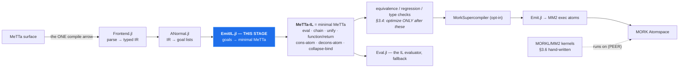

# The MeTTa → MeTTa-IL stage (design)

Design for `Core/src/compiler/EmitIL.jl`, the missing arrow — written before the code, because the
last emitter was built into the **wrong layer** and it took reopening the whitepaper to notice
(~1962 LOC targeting a stage with no incoming arrow). A diagram makes that check unskippable.

## 1. Where it goes

Figure 2 has exactly **one** compile arrow. MM2 reaches a node by a *dashed* "runs on" edge — a peer,
not a target.



The defect is **not** that `Emit.jl` emits MM2. SPECMAP C6: *"Fig-2 REQUIRES an MM2 emitter; what it
forbids is reaching MM2 WITHOUT PASSING THROUGH THE IR. `Emit.jl` is the right component in the wrong
POSITION; the fix is inserting the IR above it, not deleting it."* Today `ANormal → Emit` is a direct
edge; this stage goes between.

**Which "MeTTa-IL"?** Three artifacts share the name (SPECMAP C7). The target is **Hyperon minimal
MeTTa**. `MeTTaIL.jl` is the F1R3FLY GSLT `~>` artifact and contains *none* of these instructions —
it is not this stage and must not be routed through.

## 2. The mapping

Semantics from `docs/specs/metta grammar/metta_language_spec.md` §3 (normative table), cross-checked
against `Eval.jl:40` `MINIMAL_OPS`, which Core already evaluates.

A goal list is a conjunction; in minimal MeTTa a conjunction is a right-nested `chain` — bind an
intermediate, continue with the template. A-normal form already names every intermediate, so it maps
directly.

| goal | emitted | `Emit.jl` (MM2) |
|---|---|---|
| `GUnify(l,r)` | `(unify l r ⟨cont⟩ (return Empty))` | ✅ |
| `GCall(h,args,out)` | `(chain (eval (h args…)) out ⟨cont⟩)` | ✅ |
| `GBranch(c,cv,t,e,out)` | `⟨c⟩` then `(unify cv True ⟨t⟩ ⟨e⟩)` | ❌ declined |
| `GFindall(tmpl,body,out)` | `(chain (collapse-bind ⟨body⟩) out ⟨cont⟩)` | ❌ declined |
| `GDisj(branches,out)` | N separate `(= head body)` clauses | ❌ declined |
| `GResidual` | decline — counted, never dropped | ❌ declined |

A clause becomes `(= (f $x …) (function ⟨chain … (return $out)⟩))`.

**Why `GDisj` is not `superpose-bind`:** the table is precise — `(superpose-bind <result of
collapse-bind>)` consumes a collapse-bind result, not a branch list. Native MeTTa nondeterminism is
multiple `(=)` clauses (§2.1), which is what `GDisj`'s own docstring anticipates: *"whether a
disjunction becomes several MM2 exec rules or one is an EMISSION decision, and this stage must not
pre-empt it."* Decision made here: one clause per branch.

**Coverage: 2 of 6 → 5 of 6 goal types.** `Emit.jl:30-31` states its scope — only all-`GCall`/`GUnify`
clauses. Minimal MeTTa has native forms for branch, findall and disjunction that MM2 exec atoms lack.
That is a hypothesis to MEASURE on the corpus, not a claim to assert; the ratchet reports the number.

## 3. Invariants

1. **Invariant 1 (sequential effects)** — enforced above the lanes by `split_program_regions`
   (`SexprForms.jl`). This stage inherits it and must not re-flatten.
2. **Invariant 6 (dispatch = `query($space, (= $atom $X))`)** — emitting `(= head body)` preserves
   multi-result dispatch by construction. An MM2 `exec` is consumed on selection and one-shot, which
   is the deeper reason MM2 cannot *be* the IL.
3. **Decline visibly, never drop** — counted with reasons, as `Emit.jl` does.
4. **No `Any`-typed containers**, tests included.

## 4. Verification

Oracle, not pinned literals: feed each emitted clause to `Eval.jl` and compare answers against the
same source program through the interpreter. Assert on evaluated **answers**, never on emitted text.

## 5. ROOT CAUSE (2026-09-03) — a CROSS-HEAD call in `let`-VALUE position is frozen as DATA

This section was wrong twice before landing here. Both earlier readings are recorded at the end,
because each was refuted by a cheaper test than the one that produced it.

### The defect

`compile_run` answers EMPTY for a head whose body `let`-binds a call to ANOTHER user-defined head:

```metta
(= (upto $k $n) (if (> $k $n) () (let $rest (upto (+ $k 1) $n) (cons-atom $k $rest))))
(= (fl   $n)    (let $ix (upto 0 $n) (map-atom $ix $x (fib $x))))
!(fl 5)     ; compiled: <EMPTY>    interpreter: (0 1 1 2 3 5)
```

`compiled = 3`, `fell_back = 0`, `exhausted = String[]` — the compiler accepted it, declined nothing
and did not run out of steps. It emitted a wrong clause. Compare the IL, same program, same run:

```
upto  ✅  … (chain (metta (upto $__t3 $n) %Undefined% &self) $__t4 (unify $rest $__t4 …
fl    ❌  (= (fl $n) (function (unify $ix (upto 0 $n) (return (map-atom $ix $x (fib $x))) …
```

`upto`'s call is LIFTED into `chain (metta …)` and evaluated. `fl`'s is not: `$ix` unifies with the
UNEVALUATED TERM `(upto 0 $n)`. `map-atom`'s list parameter is typed `Expression` and so receives it
unreduced, deconses it as data, and the head symbol leaks into the result — the visible signature is
a stray `upto` where a value belongs:

```
(= (f2 $n) (let $ix (upto 0 $n) (map-atom $ix $x (+ $x 1))))   ⟹  ((+ upto 1) 1 6)
```

That WRONG ANSWER is worse than the empty one and comes from the same lowering.

### Which calls get lifted — measured, one process

| call in `let`-value position | lifted? |
|---|---|
| grounded primitive `(+ $n 1)`            | ✅ `chain (metta …)` |
| SELF-recursive `(b3 (- $n 1))`           | ✅ `chain (metta …)` |
| **CROSS-HEAD `(fib $n)`, `(upto 0 $n)`** | ❌ **bare `unify`** |
| undefined head `(zzz $n)`                | ❌ bare `unify` |

A nested argument does NOT rescue it: in `(upto 0 (+ $n 0))` the inner grounded call lifts and the
outer cross-head call still does not.

### Why — and it is ALREADY DOCUMENTED HERE

`ANormal.jl:341` decides CALL vs DATA by `is_fun(c, h, length(args))`, a STATIC set. A head that is
not in it "is DATA and stays a term, producing NO goal and being its own value". Cross-head callees
are not in that set, so they freeze.

`ANormal.jl:160-195` already states the whole thing, including the failed fix:

> Passing the Space's defined heads through as `extra_funs` was tried on 2026-08-11 and the corpus
> differential rejected it … "give `is_fun` the whole program" is NOT sufficient and is actively
> harmful on its own.
> WHAT PeTTa ACTUALLY HAS, and we have only half of. It runs BOTH mechanisms: a global `fun/1`
> AND the runtime dispatcher `reduce/2`, which keeps the term when `fun(F)` fails
> (`Out = partial(F,Args)`). We took the static half and have no deferral, so an unresolved head is
> frozen as data forever instead of being decided at run time.

So the fix shape is fixed and known: Space-wide `is_fun` for what is statically known **plus** a
`metta` chain for what is not. Neither half alone. See [[feedback_is_fun_static_half_alone_is_harmful]].

**This is why the INTERPRETER has no such bug**: it decides call-vs-data at RUN time, where the head
is either defined or it is not. The compiler must decide at COMPILE time, and currently answers "not
a function" for every head outside a narrow static set.

### `f4` LOOKED like it worked, and did not

`(= (f4 $n) (let $ix (0 1 2 3) (map-atom $ix $x (fib $x))))` returns the right answer — because it is
DECLINED and falls back to SOURCE. This lane's own docstring warns of exactly this: *"a fallback that
silently rescues the result is how a compiler comes to look complete."* Use `fallback=false` when
measuring compiled coverage; a passing answer is not evidence the compiled path produced it.

### Two refuted readings, kept so they are not re-derived

1. **"map-atom over a recursively-built list is unsupported"** (`dfe1536`) — WRONG. Bisected across
   seven constructs without varying the one number being passed in.
2. **"it is silent `max_steps` exhaustion"** (`03ec332`) — ALSO WRONG, in the opposite direction, and
   it over-retracted a real defect. `max_steps` IS surfaced, in the `exhausted` field, which was
   empty here. The budget *is* real for the INLINE spelling (4000 fails, 20000 passes) — but the
   INLINE spelling is a different lowering path from the DEFINED-HEAD one, and only the latter is
   broken. Comparing them without noticing that is what produced the false retraction.

### Still open, NOT explained by this

The `decons-atom` spelling does not terminate reasonably — 198s at `max_steps = 40000`, still running
past a 30s deadline at 200_000, twice forcing a server restart. Whether that is this same frozen-term
defect spinning, or a path `max_steps` does not bound, is UNDETERMINED.

## 5b. 🔴 STANDING RULE — BEFORE REPORTING A MECHANISM, BUILD THE OBSERVATION THAT WOULD REFUTE IT

Derived 2026-09-04 from FOUR wrong claims made in ONE day, all by the same author, all in this file's
subject area. They are not four mistakes; they are one, four times:

| claimed, as settled | refuted by |
|---|---|
| *"we built a Prolog-shaped IR without the Prolog engine"* | `ANormal.jl:31` — the goal list was chosen because a conjunction IS MM2's `(, …)`, which MORK executes via `TrieJoin` |
| *"`collapse` contradicts `ANormal.jl:922`, so there is a bypass path"* | that comment is about `_expand_goal` for the MM2 lane, not IL emission; `GFindall` has had an emitter at `EmitIL.jl:533` all along |
| *"the closure lane is GREEN on all 17 constructs"* | it DECLINED `w` on 11 of them; the `fired` count was the `nd` CALLEE, and the answer came from the space |
| *"`size-atom` is the culprit in the call-guard counts"* | identical across hyperon/CeTTa/PeTTa/Core (1, 3, 0, 2) |

**THE SHAPE, in every case: a plausible mechanism inferred from PARTIAL evidence and stated as
SETTLED.** Each was consistent with what had been observed. None was distinguished from its nearest
alternative before being reported. Three of the four would have been acted on — and the fourth would
have shipped a confident "15-case Core-vs-hyperon conformance gap" that does not exist.

⚠️ **AND THE SAME SHAPE IS WHY THIS FILE'S SUBJECT FELT ENDLESS.** "Fix the next construct at the
boundary" was itself a mechanism inferred and never tested. Three months of fixing instances, and the
test that dissolved two whole backlog items (§7) took one afternoon once it was actually posed.

### The countermeasure, which is cheap and went 3-for-3 the day it was written down

**Before reporting a mechanism, construct the observation that DISTINGUISHES it from the nearest
alternative — and run that, not a confirmation of the mechanism you like.**

| the question | the discriminator that settled it |
|---|---|
| does MORK unify, or is the stored variable a WILDCARD? | a REPEATED stored variable: `(p $a $a)` vs query `(p 1 2)`. Wildcard hits, unification misses. → **0**, three ways |
| is `size-atom` the divergence? | run `size-atom` ALONE across four engines, not inside the corpus |
| is the closure lane green, or did it DECLINE? | report the head UNDER TEST's own emitted+fired status, not a total |

Note what each has in common: it is an observation on which the two candidate mechanisms give
DIFFERENT answers. A test the favoured mechanism passes is not evidence — the alternative usually
passes it too. That is exactly why all four wrong claims survived their own first check.

[[feedback_cheapest_disconfirming_test_first]] · [[feedback_run_the_check_before_making_the_claim]]

## 6. TWO MORE SILENT WRONG ANSWERS ON HEAD (2026-09-03) — `case` and `collapse`

Found by `tools/probe_funs_masking.jl`, which was written to size a DIFFERENT question (which
constructs double when `funs` is widened — §5's blocker). Its BASELINE run, before any pre-pass, was
supposed to be all-green. Two cases were not, and neither is a doubling.

Both have the same signature as §5's frozen-call defect: `fell_back=0`, `exhausted=[]`, and
`fallback=false` confirms the COMPILED path produced the answer. Accepted, nothing refused, wrong.

### 6.1 `case` — ZERO answers where the interpreter gives two

```metta
(= (nd) a)  (= (nd) b)
(= (w) (case (nd) ((a A) (b B))))
!(w)        ; compiled: String[]        interpreter: ["A","B"]
```
`compiled=3  fell_back=0  exhausted=[]`. A MISSING-ANSWER divergence — the worst kind to find late,
because nothing in the result distinguishes it from a query that legitimately has no answers.

### 6.2 `collapse` — collapses each branch separately instead of gathering

```metta
(= (nd) a)  (= (nd) b)
(= (w) (collapse (nd)))
!(w)        ; compiled: ["(b)","(a)"]   interpreter: ["(a b)"]
```
`compiled=3  fell_back=0`. `collapse` must gather EVERY solution into ONE list; the compiled lane
returns TWO answers, each a singleton. It applied collapse per path rather than after saturation.

⚠️ **AND `ANormal.jl:922` SAYS THIS SHOULD BE IMPOSSIBLE:** *"`collapse` gathers EVERY solution into
one list value — saturation-then-collect, not a path split. Expansion cannot express it, so it stays
declined and stays counted."* It is NOT declining here (`fell_back=0`). So either that comment is
stale or a second path reaches the emitter without going through `_expand_goal(::GFindall, …)`.
Undiagnosed — that contradiction is the first thing to resolve, not the symptom.
[[feedback_reconcile_contradictions_dont_drop]]

### Why no existing gate caught either

Same reason as §5: the corpus does not contain these shapes. `test_compile_lane.jl` covers
nondeterminism under `chain`/`eval`/`function`/`return` — added precisely because that was the
suspected double-evaluation site — but nothing puts a nondeterministic call in a `case` SCRUTINEE or
under `collapse`. [[feedback_oracle_inherits_corpus_coverage]]

### The probe, and what its baseline is worth

`tools/probe_funs_masking.jl` runs 17 constructs, each with a nondeterministic call in one syntactic
position, compiled vs interpreted. **Run it twice — the DELTA under a widened `funs` is what sizes
§5's blocker — but its BASELINE is a standing differential in its own right**, and it earned that on
the first run. 15 of 17 green; the two above are open.

## 7. 🔴 THE PROLOG FEATURES WE IMPORTED SPLIT IN TWO, AND ONLY ONE HALF WAS EVER NEEDED

Established 2026-09-03, from a question that reframed the whole backlog: *we started adopting Prolog
features from SLG tabling, but the idea is to MAP them onto MeTTa and MORK/PathMap — what exactly do
we have in MORK?*

### The test that decides each import

**Is this feature essential to HORN LOGIC, or an artifact of TOP-DOWN EVALUATION?**

Prolog evaluates Horn clauses top-down: start from a goal, resolve against heads, backtrack on
failure. MORK evaluates the same logic bottom-up: match patterns against the space, produce outputs,
repeat to fixpoint (`space_metta_calculus!`). Two classical strategies for one logic — and nearly
everything on this file's backlog is a top-down artifact sitting on a bottom-up substrate.

### The essential half — ALL PRESENT in MORK/PathMap

| Horn-logic essential | MORK/PathMap |
|---|---|
| Horn clause `H :- B1…Bn` | `(exec P (, B1 … Bn) (O H))` — body is the `,`, head is the `O` |
| conjunction | `,` + `TrieJoin` (n-ary, projection pushdown, cardinality-greedy; 680×–111000×) |
| first-argument indexing | anchored PREFIX match — indexes the whole path, strictly stronger |
| **unification** | ✅ **TWO-SIDED — MEASURED, not assumed (see below)** |
| the answer relation | `space_metta_calculus!` to fixpoint |
| negation | ⚠️ absent in MORK; WFS/`tnot` lives in Core's SLG |

**THE UNIFICATION MEASUREMENT, because everything rests on it and it was an open question.** A trie
gives fast retrieval of ground data matching a pattern — that is ONE-WAY matching. Full unification
needs variables on BOTH sides. Store an atom CONTAINING a variable, query with a constant that
appears nowhere else:

```julia
space_add_all_sexpr!(s, "(p 1 a)\n(p $a b)\n")
query "(, (p 1 $y))"  → 2 hits    # (p 1 a) AND the stored-variable atom
query "(, (p 7 $y))"  → 1 hit     # 7 is NOWHERE in the store except via the stored variable
```
⇒ the stored `(p $a b)` UNIFIED with the query's `7`.

⚠️ **THAT ALONE WAS CONFOUNDED, and the confound is now closed.** One hit on a single position is
equally consistent with the stored variable being a WILDCARD — "matches anything here" — which
produces the same count with no binding. A REPEATED stored variable separates them: a wildcard
matches each position independently and HITS; unification needs ONE consistent binding and MISSES.

```
stored (p $a $a):   (p 1 1) → 1     (p 1 2) → 0     (p 5 5) → 1     (p 5 6) → 0
stored (q $a b):    (q 7 b) → 1     (q 7 z) → 0        ← the constant still CONSTRAINS
stored (r $a $a):   (, (r $x 1) (r $x 2)) → 0          ← cross-conjunct, wildcard would SUCCEED
```

⇒ **TWO-SIDED UNIFICATION WITH REPEATED-VARIABLE CONSISTENCY, on three independent discriminators.
`GUnify` maps onto the substrate.** Consistent with LeaTTa's `MatcherCorrect.lean`, which PROVES the
repeated-variable re-check — a wildcard result here would have contradicted a machine-checked one.
(Join sanity: `(, (parent $p $a) (parent $p $b))` over 3 facts → 5 rows = tom×2×2 + ann×1.)

### The top-down half — and it is the ENTIRE backlog

| top-down artifact | why bottom-up does not need it | our status |
|---|---|---|
| backtracking, choice points | no goal stack to unwind | absent, correctly — our SLG has ZERO choice points |
| `findall/3` (`GFindall`) | "all solutions" is not an OPERATION bottom-up; it is the RELATION after saturation | ⇒ `_expand_goal(::GFindall) = nothing` is **NOT A GAP** — MM2 correctly declines something its strategy does not need. This file recorded it as a hole for weeks. |
| `current_predicate` (`is_fun`) | you never ask "is there a clause to resolve against"; you match and see what fires | ⇒ **four reverted attempts to statically approximate an answer to a question the substrate does not pose** (§5) |
| cut | — | n/a |

### What this does NOT dissolve — the real engineering

⚠️ **`collapse` and `saturate!` are the same SHAPE at different SCOPE.** `collapse` gathers the
results of evaluating ONE EXPRESSION; `saturate!` runs rules to fixpoint over A SPACE. The lead is
right in spirit — the substrate primitive, not Prolog's `findall` — but the scope gap is where the
work is, not a rename.

⚠️ **One-shot exec is a genuine mismatch, not an artifact.** A Horn clause is PERSISTENT: resolve
against it as often as you like. MORK's `exec` is CONSUMED on selection. That is production-system /
linear-resource semantics, not logic-programming semantics, and it is the real content of
Invariant 6 — the reason `(=)` rules cannot be exec atoms.

⚠️ **OPEN: is SLG + `saturate!` deliberate redundancy or unintended duplication?** Tabling exists to
give TOP-DOWN evaluation the termination and completeness bottom-up has natively (memoized SLD, close
cousin to magic sets). We now have both roads to the same place — `tabled_eval` in Core, semi-naive
`saturate!` in MORK. If that is duplication nobody decided on, it would explain a share of the
recurring work. Not answerable from the code; it is a design question.

## 8. ⚠️ LeaTTa IS STALE — MeTTapedia SUPERSEDES IT, AND WE DEPEND ON THE STALE ONE IN 37 FILES

User direction, 2026-09-03: *"dont use LeaTTa .. use MeTTapedia, LeaTTa seems obselete."* Verified:

| repo | HEAD | Lean files |
|---|---|---|
| `dev-zone/LeaTTa` | 2026-07-20 (6 weeks) | 231 |
| `dev-zone/MeTTapedia` | **2026-08-29** | **5,731** |

MeTTapedia's latest commit is *"formalize GSLT execution and MeTTa language verticals"* — our subject.

### THE DEPENDENCY IS DEEP, so this is a migration question, not a citation swap

37 files reference LeaTTa. It is not incidental:
* `src/compiler/gslt/Presentation.jl` — *"Ported from `LeaTTa/MeTTaIL/Syntax.lean`, which is
  MACHINE-CHECKED"*; `gslt/Reduce.jl` — *"PORT, FROM `LeaTTa/MeTTaIL/Semantics/Reduce.lean`"*
* `test/oracle/leatta/` — a whole oracle directory, wired into `Core/bin/health` as the
  "LeaTTa proved-oracle (CORE_BUG gate)"
* `test_compile_lane_corpus.jl`'s second corpus — the "LeaTTa PROVED" baseline

⚠️ **NOTHING IS BROKEN.** The oracle passes and the gate is green; a stale reference is not a failing
one. What it means is that our proved baseline stopped tracking upstream six weeks ago, and any NEW
claim sourced from LeaTTa should be checked against MeTTapedia first.

### WHAT MeTTapedia HAS THAT BEARS DIRECTLY ON THIS FILE

`lean/batteries/mettail-core/MeTTailCore/`:
* **`EvalIR.lean`** — a minimal evaluator IR (intLit/boolLit/ifCond/==/+/-/*/userCall), fuel-bounded,
  sorry-free. Its own primer: *"The MM2 protocol types (ReqId, MM2Fact, MM2Step) formalize the
  request/result/join state machine **THAT MORK EXECUTES**, including IntArithSink grounded
  arithmetic."* ⇒ a machine-checked spec for the MM2 side of §7's one-shot-exec question.
* **`EvalIRMachine.lean`** — an abstract worklist machine, canonical `CallKey`s.
* **`EvalIRRefinement.lean`** — REFINEMENT from the IR to that machine. That is the
  "does the lowering preserve semantics" obligation, discharged upstream.
* **`EvalIRTablingMachine.lean`** — tabling over the same machine, and its doc comment says
  *"Preserve unique answers while keeping left-to-right arrival order"* ⇒ a machine-checked answer to
  the ANSWER-ORDER question `test_index_jit_oracle.jl` had to leave unpinned (we measured REVERSE
  order and correctly declined to pin it as a contract).
* `Mettapedia/GSLT/` — a whole directory, where our `gslt/` port's source now lives upstream.

⚠️ **SCOPE HONESTLY:** `EvalIR` is a *vertical slice* — int/bool literals, `if`, `==`, three
arithmetic ops, `userCall`. It is not full MeTTa and is not a drop-in spec. What it is, is a
machine-checked treatment of exactly the fragment where our defects live, including a refinement
proof and a tabling machine — read it before deciding §7's open question.

### UPDATED 2026-09-04 to `ca13bf8d` — "integrate GSLT, OSLF, and MeTTa metatheory"

1,828 files, +483,700 lines; Lean files 5,731 → 7,067; `papers/metatheory.tex` is new (3,569 lines).
`MeTTailCore/` (EvalIR, the refinement, the tabling machine) is UNCHANGED, so the reading above
stands.

🎯 **THE NEW PIECE THAT IS DIRECTLY OURS — a TYPE-GUARDED CALL conformance oracle.**
`lean/mettapedia/scripts/conformance/petta_mainline_call_guard_reference.metta` (87 lines) +
`check_petta_mainline_call_guard_reference.py` (283 lines). Each result is
`(case-name successful-branch-count)`, compared against *"the independently executed Lean judgment"* —
i.e. an ENGINE-AGNOSTIC driver against a machine-checked answer, which is exactly the shape of oracle
this file keeps wanting and mostly lacking.

And one of its cases is the defect that cost the first hour of 2026-09-03:

```metta
; The ordinary Expression output guard makes this case fail if the Atom input
; is evaluated to 5 instead of being passed as the raw source expression.
(: cg_ref_raw (-> Atom Expression))
(= (cg_ref_raw $x) $x)
!(raw-atom (size-atom (collapse (cg_ref_raw (+ 2 3)))))
```

That is the `Atom`/`Expression`-typed-parameter-receives-its-argument-UNREDUCED rule — the reason
`(let $ix (upto 0 5) (map-atom $ix …))` spliced `(upto 0 5)` in raw and answered `(0 upto 1 5)`.
It also covers `%Undefined%`, the `_` hole, metatype fallback, and the primitive-annotation cut.

⇒ **ADOPT IT — but the "cheap" in an earlier draft of this line was wrong, and here is the actual
cost, measured 2026-09-04.**

**WHY IT IS WORTH ADOPTING, stated properly.** Every oracle we have grades ANSWERS — the interpreter
differential, both corpora, `probe_funs_masking.jl`. This one grades the TYPE-GUARDED CALL DECISION
itself, case by case, against a machine-checked judgment. That decision is what produced the frozen
call, `case`, `collapse`, and four `is_fun` reverts. The payoff is not the ~20 cases: it is that
`is_fun` attempt #5 stops being an all-or-nothing corpus gamble. Today the only verdict is a
four-hour suite run saying pass-or-revert; with per-case branch counts you can see WHICH guard
decisions moved and in which direction. That is the difference between a gated experiment and a coin
flip, and it is what would have made attempts #1–#4 cheap.

**⚠️ AN ENGINE BASELINE CANNOT SUBSTITUTE FOR THE LEAN JUDGMENT. MEASURED, having tried it:**
* The corpus is a **PeTTa MAINLINE** reference. hyperon ERRORS on its last two cases —
  `add-atom &cg_ref_space …` → *"add-atom expects a space as the first argument"* — because it
  assumes PeTTa's auto-created named spaces.
* Worse, **hyperon's own numbers are internally inconsistent** on the same expression:
  `!(collapse (cg_ref_exact 3))` → `[(3)]` (one element) but
  `!(size-atom (collapse (cg_ref_exact 3)))` → `[2]`. Raw binary, no harness normalisation. So the
  counts are sensitive to evaluation context and cannot calibrate anything by themselves.
* `size-atom` is NOT the culprit — it is identical across hyperon/CeTTa/PeTTa/Core (1, 3, 0, 2).
  That was a hypothesis, checked, and refuted.
⇒ The expected values come from the driver's own `LEAN_PROBE` via `lake env lean`, and there is no
shortcut around it. Comparing Core to hyperon on this corpus would have produced a confident wrong
"15-case conformance gap".

**FEASIBLE — the toolchain is present.** `lake`/`lean`/`elan` on PATH, `~/.elan` present,
`lean-toolchain` pins `leanprover/lean4:v4.31.0`. The cost is a `lake build` of MeTTapedia (7,067
Lean files), not a missing dependency.

**CORE'S CURRENT NUMBERS, recorded so the first real run has something to diff against** (from
`metta_xcheck.sh`, 2026-09-04 — NOT yet graded, no judgment obtained):
`primitive-number-type 1 · primitive-annotation-cut 0 · primitive-no-undefined 0 ·
unknown-type-fallback 1 · exact-number 1 · wrong-input 1 · wrong-result 1 · metatype-fallback 1 ·
raw-atom 1 · unchecked-input 1 · hole-input 1 · exact-softcut-single 1 · two-overloads 1 ·
duplicate-chain 2 · unchecked-outputs 3 · revision-before-add 1 · revision-after-add 1 ·
revision-number-after-add 1 · revision-after-remove 1 · owned-number 1 · owned-wrong 1`

**WHEN ADOPTED: DO NOT GATE ON IT IMMEDIATELY.** Record the baseline, treat deviations as FINDINGS,
and use `_CC_KNOWN`'s pattern from `test_compile_lane_corpus.jl` — EXACT equality against a recorded
table, so an improvement surfaces instead of staling the baseline silently (which is exactly how that
file caught `c3_pln_stv` going 3 → 1 today).

**NOT ACTED ON.** Migrating the GSLT port and the proved oracle off LeaTTa is a real piece of work
with a green gate currently resting on it. Recorded so the next session does not source a NEW claim
from a six-week-stale repo — which is precisely how two hours went today on stale prose.
