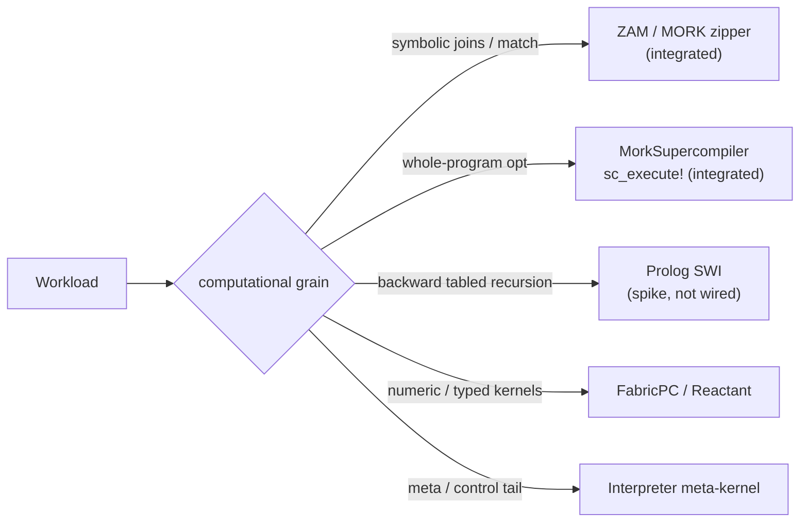
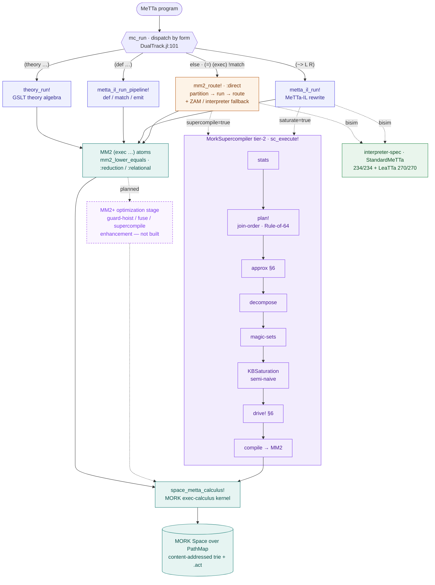

# Execution Backends

MeTTaCore is not a single interpreter — it is a **front-end over several execution engines**, with the
long-term design routing each workload to the engine that fits its computational grain. This page
documents what Core integrates today and where the architecture is heading.

> Architectural basis: the cross-cutting spec
> [`docs/specs/execution_model_architecture.md`](https://github.com/CognitiveSubstratesAI/docs)
> ("engine-per-workload"). Status there: *decided (analysis); first step = measure before building.*

## Engine-per-workload routing

The tree-walking interpreter is the root performance cost (re-match / re-dispatch per node). The model
shrinks it to a small reflective meta-kernel and routes the hot paths to specialized engines:

| Workload | Engine | Status in Core |
|---|---|---|
| symbolic multi-leg joins / pattern matching / head dispatch | **ZAM / MORK** — the Zipper Abstract Machine (the PathMap zipper) | ✅ **integrated** (the substrate) |
| whole-program optimization (join-order, saturation, MM2 lowering) | **MorkSupercompiler** (tier-2) | ✅ **integrated** ([`sc_execute!`](@ref)) |
| backward goal-directed **tabled** recursion (SLG + well-founded negation) | **Prolog (SWI)** now → native tabling-over-ZAM later | ⏳ **exploration / spike — not wired into Core** |
| numeric / typed hot kernels | native (FabricPC / Reactant / typed-Julia) | external packages |
| meta / control tail (`function`/`return`, type-cast, reflection) | small interpreted **meta-kernel** | the current Interpreter |

## `mc_run` — the concrete dual-track pipeline

The routing above is the *model*; [`mc_run`](@ref) (`DualTrack.jl`) is the *implementation*. It is a single
entry that **dispatches by program form** into four front-ends — the `:direct` lane (Core forms lowered
straight to MM2, no intermediate IL) and three [MeTTa-IL-family](mettail.md) lanes (`:rewrite`, `:pipeline`,
`:theory`). All four emit MM2 `(exec …)` atoms onto the **one** shared MORK / PathMap substrate, and each
**bisimulates against the interpreter-spec**. The MorkSupercompiler tier-2 pipeline is an *opt-in backend*
reachable from two lanes (`supercompile=true` on `:direct`, `saturate=true` on `:rewrite`) — not a lane of
its own.

Dashed edges are opt-in or planned. The **MorkSupercompiler tier-2** chain (`sc_execute!`) is
`stats → plan! → [approx §6] → decompose → [magic-sets] → KBSaturation (semi-naive) → [drive! §6] →
compile → MM2` — the bracketed stages are `SCOptions` opt-ins. **MM2+** (guard-hoist / fuse / supercompile
over the lowered exec atoms) is a designed-but-unbuilt optimization stage. The `:reduction` lowering mode
is `mc_run`'s default (function-eval / redex-delete); `:relational` (forward-closure) is explicit opt-in.

## Three orthogonal layers — substrate vs engines vs cognitive processes

"Engine-per-workload" is a statement about the **middle** layer only. Keep three axes distinct
(collapsing them is a recurring framing error):

1. **Cognitive processes** — forward-chaining, backward-chaining (PLN demand / tabling), abduction,
   MOSES evolution, ECAN attention, concept blending. These are **distinct reasoning paradigms** that
   synergize through the shared AtomSpace (OpenCog "cognitive synergy"), **not** interchangeable
   backends. Promote them as first-class modes.
2. **Execution engines** — ZAM zipper, MorkSupercompiler, native-tabling-over-PathMap, numeric
   kernels. **Semantics-preserving** executors chosen by the γ̂ diagnostic. "Backend" is the right word
   *only here* — it's about speed, not meaning.
3. **Substrate** — MORK / PathMap: the **one** shared metagraph memory + base rewriting/query. It is
   neither a cognitive architecture nor "a backend among others"; keeping it **singular** is what makes
   the cognitive synergy possible (every process reasons over the *same* atoms).

So **Prolog** is a *backward-tabled reasoning strategy* (layer 1) best realized as *native tabling over
PathMap* (layer 2) — **not** a parallel cognitive architecture with its own store (that would fork the
substrate, which is explicitly ruled out). The positive/stratified fragment of that strategy already
runs on the forward engine (semi-naive saturation + magic-sets + stratified NAF); the only genuinely
distinct residual is **WFS recursion-through-negation**.

## MORK / ZAM — the substrate backend (integrated)

Every Core atom is a byte-path in a **MORK PathMap** trie; matching and joins run on the **ZAM (Zipper
Abstract Machine)** — the zipper traversal already implemented in PathMap, *not* a model to build. By the
Mork-theory selectivity theorem, the zipper delivers O(1) candidates to the unifier for selective
symbolic joins (where a WAM is Ω(N) per leg). Core exposes the native engine directly through the
**E1 bridge** ([`mork_unify`](@ref), [`mork_apply`](@ref), [`mork_rule_rewrite`](@ref)) and the
trie-index query `space_query_multi` — the same path the [Pattern Mining](pattern_mining/overview.md)
native count and the connectome `info_flow` workload use.

The MM2 exec-calculus (`(exec …)`) and the [MeTTa-IL lane](mettail.md) both lower onto this substrate.

## MorkSupercompiler — the optimization backend (integrated)

[`sc_execute!`](@ref) runs a program through the **tier-2 MorkSupercompiler** against the space's trie:
join-order + Rule-of-64 decomposition (tier-1 `plan!`), plus opt-in stages — error-bounded approximate
rewrite, **KBSaturation** (seminaive fixpoint — the recursive-closure engine the [MeTTa-IL lane](mettail.md)
uses via `saturate=true`), **magic-sets goal-direction** (`use_magic_sets` — a bottom-up surrogate for
top-down SLG tabling that rewrites the rules toward a query so saturation tables only goal-relevant facts;
sound for the single-predicate / self-recursive / bound-first fragment, falls back to full closure
otherwise), the §6 supercompilation driver, and MM2 lowering. Stage opt-ins live on `SCOptions` and are
reachable identically from both lanes (Direct via `supercompile=true`, MeTTa-IL via `saturate=true`).

!!! note "Materializing, not streaming"
    The supercompiler **materializes** intermediate join results as `_sc_tmp` trie atoms — measured **~5–30×
    slower than streaming** (`docs/specs/execution_model_architecture.md`: 771ms vs 24ms ≈ 32×, 2389ms vs
    504ms ≈ 4.7×). It is an *optimization/closure* layer, not the fast match path. The **streaming fast path
    is lean selective probing on the zipper (ZAM)** (`space_query_multi` / the connectome `info_flow`), which
    realizes the MORK selectivity result — **O(1) candidates vs a WAM's Ω(N) per leg** under Σγ>1
    (`Mork-theory`), an *asymptotic* advantage, not a fixed factor. Use the supercompiler for saturation and
    whole-program rewriting, not as a general query accelerator.

## Prolog — the tabled-recursion backend (exploration, not wired)

**Honest status: Prolog is not integrated into Core.** No Prolog code ships in `src/`. It is a *decided
architectural role* with a validated FFI **spike**, not a live backend.

The engine-per-workload analysis assigns Prolog exactly **one** job: **backward, goal-directed, tabled
recursion** (SLG resolution with well-founded-semantics negation) — the one workload the forward ZAM does
*not* cover. The plan is **SWI-Prolog via a `libswipl` FFI bridge now, phased to native tabling-over-ZAM
later**, so the dependency is temporary. Explicitly ruled out: *compiling everything to Prolog* (PeTTa's
model) — it would make Core permanently Prolog-bound and SWI is slow at simple predicate calls.

What exists today (in the cross-cutting `docs/specs/prolog/`, **not** in this repo):

- `prolog_mork_dual_backend_plan.md` — the dual-backend plan and phase-out path.
- `SWI-Prolog_10.1.9_ch7_tabling_spec.md` — the SLG tabling semantics (the genuine gap).
- `spike/` — a runnable FFI spike (`swipl_ffi_spike.{pl,jl}`, `PrologBackend.jl`, `test_prolog_backend.jl`, 5/5) proving the Julia ↔ SWI bridge and the adapter shape.

Before any wiring, the discipline is **measure first** — the γ̂ selectivity diagnostic determines which
workloads actually need backward tabling versus the forward zipper. That diagnostic is **built**
(`MORK/tools/zam_diagnostic.jl` — `γ̂ = −log_N(|P(p)|/N)` with the Σγ̂ regime split, self-checked) but is
a standalone REPL tool, **not yet wired** into any routing decision. Until a measured workload demands it,
Prolog stays an exploration.

!!! note "Prolog as a complementary interim engine (decision in progress)"
    The plan endorses SWI **now** → native-tabling-over-PathMap **later**. To use it as a complementary
    interim engine *without* forking the substrate, three guardrails: (1) **scope to the residual** — WFS
    recursion-through-negation only (the forward engine already covers positive/stratified); (2) **marshall,
    don't mirror** — atoms→Prolog terms per query, answers back, drop Prolog state (MORK stays the single
    source of truth); (3) **concrete exit** — retire when native WFS passes SWI's conformance set (parity)
    and γ̂ says the workload doesn't need it, else it acquires permanent lock-in. **Highest-value first step
    is the differential ORACLE, not the engine**: wire SWI as ground truth to validate native WFS against
    (the pattern that de-risked the PLN chainer via `PLNDemand.jl`), and promote oracle→engine only if a
    measured WFS workload arrives before native is ready.

!!! note "Positive-fragment coverage (what the forward engine already tables)"
    Semi-naive `saturate!` (live) + magic-sets goal-direction (opt-in) cover **positive recursive closure**
    (transitive closure / ancestor / path) — the bottom-up equivalent of top-down SLG tabling for the
    positive fragment. **Arithmetic/comparison guard premises** (`< > <= >= == != + - * / %`) are now
    EVALUATED in rule bodies (mirroring `GROUNDED_REGISTRY` so they bisimulate the MM2 calculus lane):
    comparisons filter; a 3-arg `(op a b c)` binds its output. A value-generating rule needs a bounding
    guard to terminate — an unbounded one is truncated at the round cap with a warning (the pragmatic
    stand-in for the supercompilation homeomorphic-embedding whistle). What still routes to no engine:
    **negation** of any kind (NAF, stratified, or well-founded), **relational aggregation**, and
    **incremental retraction / TMS** — the genuine residual gaps.

## The Interpreter as meta-kernel

The standard [Interpreter](mettail.md) is the live evaluator today and the conformance reference (the
spec the other lanes bisimulate against). In the target model it shrinks to the **~5% reflective
meta-kernel** — `function`/`return`, type-cast, reflection — while ZAM owns matching and the supercompiler
owns whole-program optimization. The end state is *not* "zero interpreter" but a thin reflective tail over
engine-routed hot paths.
