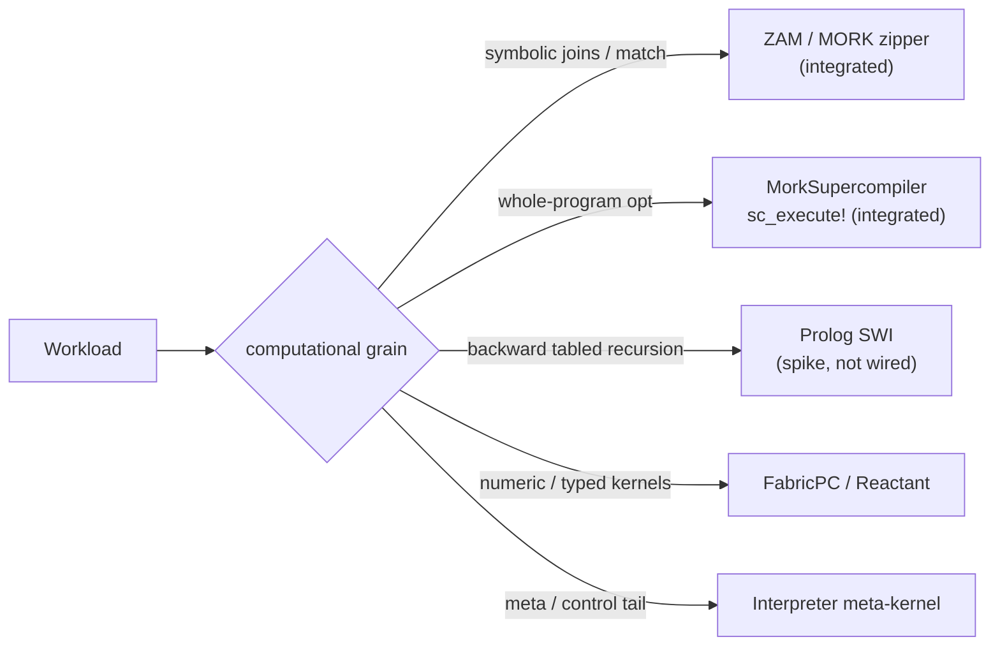

# Execution Backends

MeTTaCore is not a single interpreter — it is a **front-end over several execution engines**, with the
long-term design routing each workload to the engine that fits its computational grain. This page
documents what Core integrates today and where the architecture is heading.

> Architectural basis: the cross-cutting spec
> [`docs/specs/execution_model_architecture.md`](https://github.com/CognitiveSubstratesAI/docs)
> ("engine-per-workload"). Status there: *decided (analysis); first step = measure before building.*

## Engine-per-workload routing

The tree-walking interpreter is the root performance cost (re-match / re-dispatch per node). The model
shrinks it to a small reflective meta-kernel and routes the hot paths to specialized engines:

| Workload | Engine | Status in Core |
|---|---|---|
| symbolic multi-leg joins / pattern matching / head dispatch | **ZAM / MORK** — the Zipper Abstract Machine (the PathMap zipper) | ✅ **integrated** (the substrate) |
| whole-program optimization (join-order, saturation, MM2 lowering) | **MorkSupercompiler** (tier-2) | ✅ **integrated** ([`sc_execute!`](@ref)) |
| backward goal-directed **tabled** recursion (SLG + well-founded negation) | **Prolog (SWI)** now → native tabling-over-ZAM later | ⏳ **exploration / spike — not wired into Core** |
| numeric / typed hot kernels | native (FabricPC / Reactant / typed-Julia) | external packages |
| meta / control tail (`function`/`return`, type-cast, reflection) | small interpreted **meta-kernel** | the current Interpreter |

## MORK / ZAM — the substrate backend (integrated)

Every Core atom is a byte-path in a **MORK PathMap** trie; matching and joins run on the **ZAM (Zipper
Abstract Machine)** — the zipper traversal already implemented in PathMap, *not* a model to build. By the
Mork-theory selectivity theorem, the zipper delivers O(1) candidates to the unifier for selective
symbolic joins (where a WAM is Ω(N) per leg). Core exposes the native engine directly through the
**E1 bridge** ([`mork_unify`](@ref), [`mork_apply`](@ref), [`mork_rule_rewrite`](@ref)) and the
trie-index query `space_query_multi` — the same path the [Pattern Mining](pattern_mining/overview.md)
native count and the connectome `info_flow` workload use.

The MM2 exec-calculus (`(exec …)`) and the [MeTTa-IL lane](mettail.md) both lower onto this substrate.

## MorkSupercompiler — the optimization backend (integrated)

[`sc_execute!`](@ref) runs a program through the **tier-2 MorkSupercompiler** against the space's trie:
join-order + Rule-of-64 decomposition (tier-1 `plan!`), plus opt-in stages — error-bounded approximate
rewrite, **KBSaturation** (seminaive fixpoint — the recursive-closure engine the [MeTTa-IL lane](mettail.md)
uses via `saturate=true`), the §6 supercompilation driver, and MM2 lowering. Stage opt-ins live on
`SCOptions`.

!!! note "Materializing, not streaming"
    The supercompiler **materializes** intermediate join results as trie atoms — measured at a ~40× join
    regression versus streaming. It is an *optimization/closure* layer, not the fast match path; the
    streaming fast path is lean selective probing on the zipper (ZAM). Use it for saturation and
    whole-program rewriting, not as a general query accelerator.

## Prolog — the tabled-recursion backend (exploration, not wired)

**Honest status: Prolog is not integrated into Core.** No Prolog code ships in `src/`. It is a *decided
architectural role* with a validated FFI **spike**, not a live backend.

The engine-per-workload analysis assigns Prolog exactly **one** job: **backward, goal-directed, tabled
recursion** (SLG resolution with well-founded-semantics negation) — the one workload the forward ZAM does
*not* cover. The plan is **SWI-Prolog via a `libswipl` FFI bridge now, phased to native tabling-over-ZAM
later**, so the dependency is temporary. Explicitly ruled out: *compiling everything to Prolog* (PeTTa's
model) — it would make Core permanently Prolog-bound and SWI is slow at simple predicate calls.

What exists today (in the cross-cutting `docs/specs/prolog/`, **not** in this repo):

- `prolog_mork_dual_backend_plan.md` — the dual-backend plan and phase-out path.
- `SWI-Prolog_10.1.9_ch7_tabling_spec.md` — the SLG tabling semantics (the genuine gap).
- `spike/` — a runnable FFI spike (`swipl_ffi_spike.{pl,jl}`, `PrologBackend.jl`, `test_prolog_backend.jl`, 5/5) proving the Julia ↔ SWI bridge and the adapter shape.

Before any wiring, the discipline is **measure first** — the γ̂ selectivity diagnostic determines which
workloads actually need backward tabling versus the forward zipper. Until a measured workload demands it,
Prolog stays an exploration.

## The Interpreter as meta-kernel

The standard [Interpreter](mettail.md) is the live evaluator today and the conformance reference (the
spec the other lanes bisimulate against). In the target model it shrinks to the **~5% reflective
meta-kernel** — `function`/`return`, type-cast, reflection — while ZAM owns matching and the supercompiler
owns whole-program optimization. The end state is *not* "zero interpreter" but a thin reflective tail over
engine-routed hot paths.
