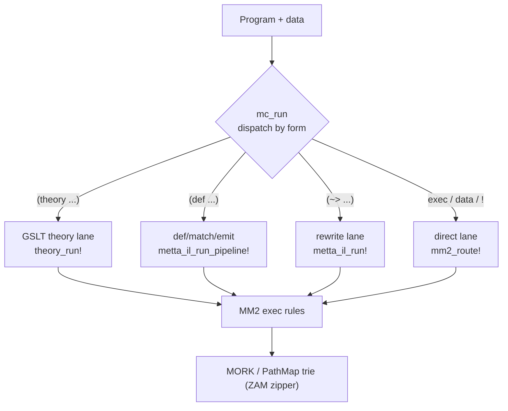

# MeTTa-IL Lane

MeTTaCore supports **two execution lanes** over one MM2/MORK substrate: a CeTTa-style **direct** lane
(interpreter-spec + MM2 router) and the F1R3FLY **MeTTa-IL** layered pipeline documented here
(`MeTTa → MeTTa-IL → MM2 → MORK`). Both bisimulate against the interpreter-spec. A single entry,
[`mc_run`](@ref) (see [below](#Unified-entry-mc_run)), dispatches to the right lane by program form.

The MeTTa-IL lane (`src/standard/MeTTaIL.jl`) lowers a theory's **rewrites** to MM2 `exec` rules and runs
them on the native MORK substrate — no surface→IR rewrite, no FFI. It is grounded in the *actual* F1R3FLY
upstream (the GSLT `.module` representation + mettail-rust), not the scalable-infra paper's §9.1 sketch:
the executable reduction relation is the **rewrites** `Name : LHS ~> RHS`, written `(~> LHS RHS)`.

## Two `~>` modes (same surface, different semantics)

`~>` has two legitimate execution interpretations; pick by workload:

| Mode | Function | Semantics | Use |
|---|---|---|---|
| Forward-derivation | [`metta_il_run!`](@ref) | additive: LHS present → *derive* RHS (kept) | relational / Datalog (transitive closure, deductive queries) |
| Term reduction | [`metta_il_normalize`](@ref) | redex → contractum, **with congruence** (reduce in context) | calculi (rho/lambda, equational reduction) |

`(~> LHS RHS)` lowers to MM2 `(exec 0 (, LHS) (, RHS))` ([`metta_il_lower_rewrite`](@ref)).

## Recursive closure (saturation)

The single-step exec calculus does one generation, so recursive rewrites (a rewrite whose RHS head also
appears in a body — e.g. transitive closure) don't close. Pass `saturate=true` to [`metta_il_run!`](@ref):
rewrites lower to KBSaturation forward rules ([`metta_il_lower_saturation`](@ref)) and run to fixpoint
(value-deduped, so cyclic input terminates).

## Congruence

> 🔴 **THE PARAGRAPH BELOW IS REFUTED. Kept, struck through, because the error is the useful part.**
>
> ~~GSLT/mettail-rust spell out explicit congruence rules … only because their relational backend
> can't reduce subterms … the subterm descent *is* the congruence.~~
>
> **Congruence rules are the specification of WHERE reduction is permitted, not a workaround for a
> weak backend.** The author's own AGI-2026 Hyperon Workshop presentation (L.G. Meredith, F1R3FLY.IO)
> settles it:
>
> * `Lambda` declares ONE base rule (`Beta`) and **THREE** congruence rules (`AppCongL`, `AppCongR`,
>   `LamCong`). If base rewrites already fired under any context, all three would be redundant.
> * `RhoCalc` is the sharper case: **exactly one** congruence rule, `ParCong` for `PPar`, and **none**
>   for `PInput`. That is the specification saying reduction happens under parallel composition and
>   **not** under an input prefix.
>
> ⚠️ **Weight of this source, stated:** a summary deck presenting a draft, by the framework's author.
> Normative for what MeTTaIL *intends*; not a substitute for the implementation where the two differ.
>
> **MEASURED IN OUR TREE 2026-09-18 — the defect is real and it is in the TRAVERSAL, not the rules.**
> A two-rule theory: base `(f $X) ~> $X`; `par` declares a congruence rule, `guard` declares none.
>
> | call | `(par (f a))` | `(guard (f a))` | |
> |---|---|---|---|
> | `reducts` (root only) | `(par a)` | `Atom[]` | ✅ the rules themselves are correct |
> | `cond_step` | `(par a)` | **`(guard a)`** | 🔴 stepped with no congruence rule |
> | `cond_normalize` | — | **`((guard a), 1023)`** | 🔴 normalizes through it |
> | `one_step` (`Context.jl`) | — | **`(guard a)`** | 🔴 the PORTED layer |
>
> The root-only control is what localises it: at the root the declared rules behave exactly as the
> spec says, so declared congruence rules are not being ignored — `Context.step_with` descends into
> every argument unconditionally, so they cannot *restrict* anything. For `Lambda` that is harmless
> (the three rules permit exactly what the closure does anyway); for `RhoCalc` it is wrong.
>
> **FIX SHAPE:** `step_with`'s unconditional descent becomes opt-in per theory — correct for Lambda,
> SKI and anything orthogonal; restricted theories descend only through declared congruence rules.
> The Lean citation stays intact: `oneStep` is the full-closure mode.
>
> ⚠️ **NOT YET EXPRESSIBLE, AND IT BLOCKS THE SHARPEST TEST:** the GSLT layer has no AC support, so
> `PPar . ps:HashBag(Proc)` and `...rest` in `Comm` have no counterpart and `RhoCalc` itself cannot be
> written. The probe above deliberately does not need it — any constructor with no declared
> congruence rule exhibits the property.

## The `def/match/emit` pipeline surface (§9.1 → §9.2)

A higher-level surface for **staged relational pipelines** (e.g. pattern miners). Each `def` is a named
stage; `match` binds inputs; `when` guards; `emit` produces the next stage's facts. Per the paper's own
§9.2 lowering, each stage becomes `(exec PRIORITY (, PATS GUARDS) (, EMITS))`, PRIORITY = stage order:

```
(def increment-count ()
  (match (candidate $c $p) (count $c $p $n)
    (emit (count $c $p (+ $n 1)))))
```

[`metta_il_lower_def`](@ref) / [`metta_il_lower_pipeline`](@ref) / [`metta_il_run_pipeline!`](@ref). The
[Pattern Mining](pattern_mining/overview.md) section uses this surface; see also the
[GSLT Theory Algebra](gslt.md), whose flattened rewrites feed this lane.

## Unified entry (`mc_run`)

Rather than calling each lane's function directly, [`mc_run`](@ref) is the single dual-track entry. It
**dispatches by program form** — the lanes are different front-ends over the same MM2/MORK substrate, so
which one runs is determined by what you wrote, not by an engine switch:



| Program contains | Lane | Runs |
|---|---|---|
| `(theory …)` | GSLT theory | [`theory_run!`](@ref) (use `theory=NAME` to pick one) |
| `(def …)` | def/match/emit pipeline | [`metta_il_run_pipeline!`](@ref) |
| `(~> …)` | rewrite | [`metta_il_run!`](@ref) (`saturate=true` for recursive closure) |
| otherwise (`exec`/data/`!`) | direct | [`mm2_route!`](@ref) |

`mode ∈ (:direct, :rewrite, :pipeline, :theory)` forces a lane. The call returns `(; lane, results)` — the
chosen lane plus its native result (a `Vector{String}` for the MeTTa-IL lanes; the route NamedTuple for
`:direct`).

```julia
mc_run(cs, facts, raw"(~> (, (edge $x $y) (edge $y $z)) (trans $x $z))")
# → (lane = :rewrite, results = ["(trans 0 2)", "(trans 1 3)"])
```
