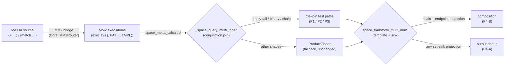

# MeTTa → MM2 → Trie-Join: Query Execution Optimization

This page documents the two-day arc (2026-06-26 → 2026-06-27) that took MeTTa rules from the
typed interpreter down to the MORK byte-calculus substrate and then made that substrate's
conjunctive-query execution **asymptotically** faster.

It has two halves:

1. **The MeTTa → MM2 bridge** (2026-06-26) — lowering relational `(= …)` / `(match …)` MeTTa rules
   into MM2 *exec atoms* that run as pattern-directed metagraph rewriting on the MORK substrate,
   plus the exec-calculus correctness fixes and a permanent differential gate.
2. **Trie-join + projection pushdown** (2026-06-27, [ADR-056](https://github.com/CognitiveSubstratesAI/docs))
   — replacing the substrate's naive `ProductZipper` conjunction join with trie-native fast paths,
   and skipping path enumeration entirely when a query projects to its endpoints.



Everything below is **additive with full fallback**: any pattern/shape an optimization does not
recognize falls through to the unchanged path. The MM2 corpus differential
([`test/integration/mm2_corpus_differential.jl`](https://github.com/CognitiveSubstratesAI/MORK))
stayed **byte-identical** through the entire arc.

---

## Part 1 — The MeTTa → MM2 bridge (2026-06-26)

MM2 is MORK's exec calculus: an atom `(exec <sys> (, PAT…) (, TMPL…))` means *match `PAT` against the
space, instantiate `TMPL` per match, apply the sink* — pattern-directed metagraph **rewriting** (not
Datalog). The bridge auto-lowers the relational subset of MeTTa into these atoms so they execute on the
substrate instead of the tree-walking interpreter.

### Bridge components (Core — `src/standard/MM2Router.jl`, `DualTrack.jl`)

| Function | Role |
|---|---|
| `mm2_lower_equals` | `(= LHS RHS)` → `(exec 0 (, LHS) (, RHS))` (relational rules only) |
| `mm2_lower_match` | `(match &space pat res)` → `(exec 0 (, pat) (, res))` |
| `mm2_is_relational` | guard — rejects rules with grounded ops / special forms, and enforces the MORK byte-Expr limits (arity 63 / 64 vars) |
| `typed_atom_to_expr` | typed `Atom` → MORK s-expr — the live-eval handoff converter |
| `mm2_lane_saturate!` | recursive Datalog fixpoint driver (full transitive closure) |
| `mc_closure!` / `!(mork-closure)` | opt-in grounded op invoking the substrate route from MeTTa source |

The boundary is **forward-rewriting closure ≠ reduction-to-normal-form**: the MM2 lane is sound only for
forward-derivation (relational) workloads; grounded/control-flow rules stay in the interpreter. This was
cross-checked against five reference MeTTa implementations (CeTTa, PeTTa, MeTTa-Compiler/F1R3FLY,
MeTTaIL) — the F1R3FLY reference independently confirms the reduction-vs-closure boundary.

### Exec-calculus correctness fixes (MORK — `src/kernel/Space.jl`)

Differential testing against the upstream `mork` binary surfaced three real bugs:

| Commit | Bug | Fix |
|---|---|---|
| `8f0d182` | O-sink set **difference** was order-dependent | `RemoveSink` now accumulates across matches → removes applied after adds |
| `7908fbd` | nested-exec **variable hygiene** — template vars collided with pattern vars | template NewVars number past the pattern's introduced-var count (`oi`) |
| `e59a16b` | `_pat_overlaps_exec_prefix` scanned the whole buffer → false-positive on the template | bound the scan to the pattern's own span |

These are locked in by the **MM2 corpus differential gate** (`eac6138`), which runs each
`MM2_Structuring_Code` tutorial program through `space_metta_calculus!` and asserts the exact upstream
atom set (catching output-level bugs that a halting check would miss).

---

## Part 2 — Trie-join fast paths (2026-06-27)

The MORK conjunction join (`_space_query_multi_inner!`) was a **naive Cartesian product**: each factor
of `(, f1 f2 …)` traverses the whole subtrie independently, and unification filters *after* enumerating
each `k`-tuple — cost `≈ Nᵏ`, order-invariant. The MORK author (Adam Vandervorst) blessed the
**trie-join** as the asymptotic fix ("introduces unions where product factors are independent"). Three
shape-specific fast paths now precede the ProductZipper, all in
[`src/kernel/TrieJoin.jl`](https://github.com/CognitiveSubstratesAI/MORK):

| Phase | Shape | Mechanism | Commit |
|---|---|---|---|
| **P1** | empty-tail `(p $x)(q $x)` (unary, one shared var) | `pmeet` of the relations' arg-value subtries | `335d940` + `c474d9c` |
| **P2** | binary `(edge $x $y)(edge $y $z)` (one shared var, free tails) | key-rotation: re-key each factor by the join var, per-key tail-product | `9e2064d` |
| **P3** | strict chain `(edge $x0 $x1)…(edge $x_{k-1} $xk)`, k≥3 | recursive depth-first **streaming** join (no intermediate materialization) | `593246d` |

### Benchmark results (vs ProductZipper, warm)

| Phase | Workload | ProductZipper | Trie-join | Speedup |
|---|---|---|---|---|
| **P1** | 2 unary relations, N=400 | 4256 ms | ~6 ms | **~680×** |
| **P2** | layered DAG 2-hop, L=4 W=20 (800 edges) | 3481 ms | 0.74 ms | **~4,730×** |
| **P3** | layered DAG 3-hop, L=4 W=7 (147 edges) | 21,205 ms | 0.19 ms | **~111,000×** |

The speedup *widens with size* — ProductZipper is `Nᵏ`/`|E|ᵏ`, the trie-join is roughly linear. P3's
21-second ProductZipper on a *147-edge* graph is the `|E|³` catastrophe the streaming join eliminates.

---

## Part 3 — Projection pushdown (2026-06-27)

End-to-end through the exec calculus, a *projecting* template surfaced a second inefficiency: e.g.
`(exec 0 (, (edge $x $y)(edge $y $z)(edge $z $w)) (, (reach3 $x $w)))` enumerates all `W⁴` 3-paths but
the output `(reach3 $x $w)` only depends on the endpoints — deduped to `W²` atoms by the set sink. Two
variants address this in `space_transform_multi_multi!`:

| Variant | Mechanism | Scope | Speedup | Commit |
|---|---|---|---|---|
| **A — dedup-at-output** | skip the redundant idempotent `set_val_at!` for repeated outputs; adaptive gate (disable if no dups in first 512 matches) | any projecting set-sink exec | **~2.4×** | `4913d32` |
| **B — composition** | compute the `W²` distinct endpoint pairs by relational composition, apply the template once per pair (skips path enumeration) | strict chain + template projects to endpoints | **~290×** | `7e8763e` |

Variant A is *always correct* (idempotent set semantics) so its projection check is pure performance.
Variant B is the asymptotic win: on the W=20 reach3 e2e it cuts **2753 ms → 9.5 ms** (`W²` result vs `W⁴`
enumeration). B correctly does *not* fire when a template uses an intermediate var
(`(pathy $x $y $w)`), or for non-chain / multiplicity-sensitive O-sink / anchored execs.

---

## Test scripts & reproduction

| Test | What it asserts | Location (MORK) |
|---|---|---|
| `TrieJoin P1/P2/P3` (21 tests) | each fast path ≡ ProductZipper / hand-computed truth, across overlap/disjoint/subset/identical/chain shapes | `test/integration/trie_join.jl` |
| `Projection pushdown A` (2) | set-sink dedup preserves the atom set; non-projecting auto-disables | `test/integration/trie_join.jl` |
| `P4-B projection composition` (2) | chain endpoint projection ≡ full exec; intermediate-var template does NOT fire B | `test/integration/trie_join.jl` |
| `MM2 corpus differential` (30) | every `MM2_Structuring_Code` idiom matches the upstream `mork` atom set (byte-identical throughout the arc) | `test/integration/mm2_corpus_differential.jl` |

Run the full MORK suite (warm REPL):

```bash
cd MORK && printf 'include("test/runtests.jl"); exit()\n' | julia --project=. -i tools/repl.jl
```

Final state: **1808 passed, 0 failed** (the one Aqua `persistent_tasks` error is an environment
subprocess-spawn limitation, unrelated). Full design, safety conditions, and per-phase gate
measurements are in
[ADR-056](https://github.com/CognitiveSubstratesAI/docs) (`docs/architecture/ADR-056_zam_cardinality_join_planning.md`).

## Real-workload validation (FlyWire connectome, 2026-06-27)

The benchmarks above use synthetic layered DAGs with **binary** `(edge $x $y)` relations. Validating
against the real FlyWire connectome info-flow workload (`MORK/examples/connectome/`) surfaced two
limitations that the synthetic shapes could not:

1. **The info-flow algorithm uses single-source anchored scans, not joins.** Its hot query is
   `(match &self (syn $r $p $c) …)` pinned by the post-neuron, folded through a ratio threshold
   (`reached-in / total-in ≥ 0.3`) with grounded ops. A conjunction needs ≥2 factors, so the trie-join
   fast paths do not fire — the workload's speed comes from by-post trie-prefix anchoring
   (`InfoFlowFast.metta`), an orthogonal optimization.
2. **Connectome relations are ternary; the classifiers require binary.** The synapse relation is
   `(syn pre post count)` (arity-4 atom, 3 args). `_classify_binary_join` / `_classify_chain` require
   exactly arity-3 factors (head + 2 args), so even a connectome *motif* query
   `(, (syn $a $b $w)(syn $b $c $w2))` does **not** fire P2/P3 (confirmed: ternary → `false`, binary
   `(edge …)` → `true`).

**Conclusion:** the trie-join is correct and large on binary path/join workloads, but does not yet apply
to raw connectome queries. The unlocking extension is **arity-N factor support** — let the join variable
sit at any argument position with the remaining args (e.g. the synapse weight) carried as tails. This is
a clean, scoped follow-on (generalize the arg-split from 2 to N and locate the shared var's position),
after which connectome motif/path queries would fire the existing composition machinery. (Until then, a
binary projection `(edge a b)` derived from `(syn a b w)` fires P2/P3 directly.)

### What is *not* built (deliberate, per the MORK author's guidance)

- **Non-chain k≥3 joins** (star / general join graphs) — would need a runtime-data-driven join-order
  planner, which upstream found "no satisfying solution without runtime data." Left to ProductZipper.
- **Independent-factor union** — a no-op for the exec-calculus consumer (the result *is* the full
  product, and the effect contract must enumerate each tuple regardless).
